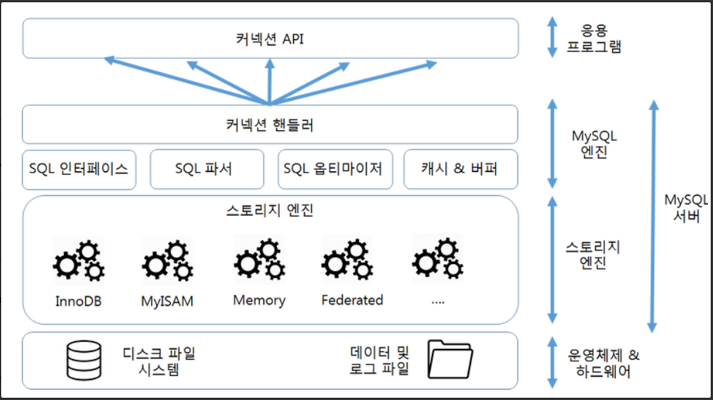
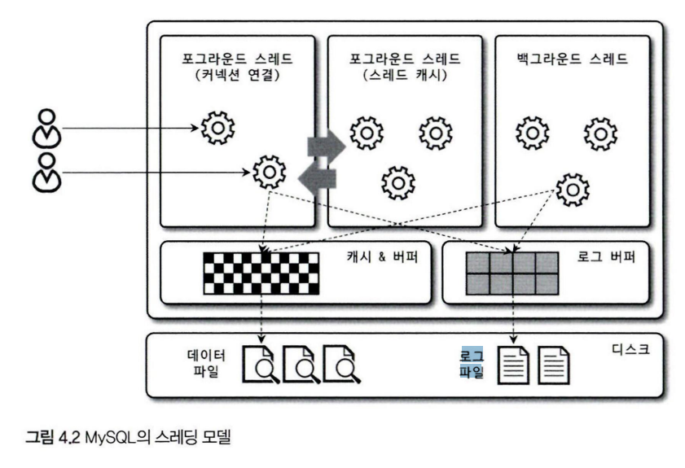
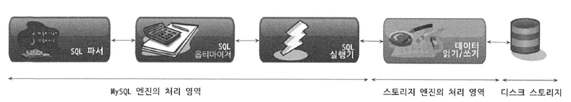
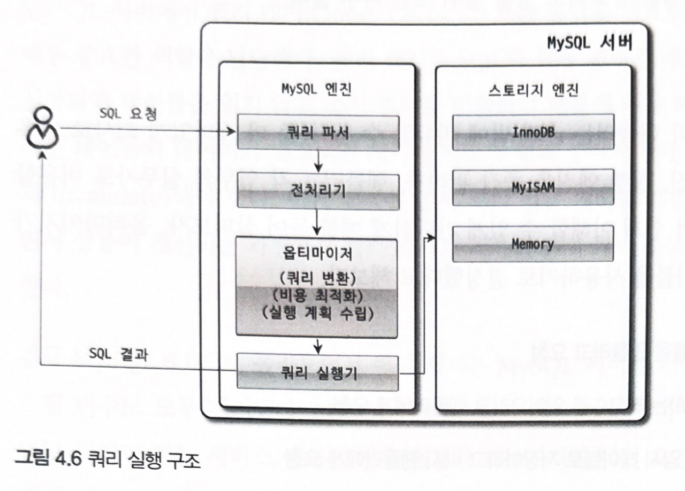

# 4. 아키텍쳐
MySQL 은 대부분의 프로그래밍 언어로부터 접근 방법을 모두 지원한다.
## 4.1 MySQL 엔진 아키텍처

### 4.1.1 MySQL 구조

#### 4.1.1.1 MySQL 엔진
1. 커넥션 핸들러 : 클라이언트로부터의 접속, 쿼리 요청 처리
2. SQL파서 : SQL문이 올바른지 확인
3. 전처리기 : 쿼리 안에 포함된 테이블 이름, 함수 등이 실제 존재하는지, 권한이 있는지 확인
4. 옵티마이저 : 쿼리의 최적화된 실행
#### 4.1.1.2 스토리지 엔진
- 실제 데이터를 디스크 스토리지에 저장, 디스크 스토리지부터 데이터를 읽어오는 것 담당
- MySQL 서버에서 MySQL 엔진은 하나지만 스토리지 엔진은 여러개 사용할 수 있다.
```sql
CREATE TABLE test_table (fd1 INT, fd2 INT) ENGINE=INNODB;
```
- 해당 테이블의 스토리지 엔진은 INNODB로 처리
- 각 스토리지 엔진은 성능 향상을 위해 키 캐시(MyIASM) 이나 InnoDB버퍼 풀(InnoDB)같은 기능 내장
#### 4.1.1.3 핸들러 API
- **핸들러 요청** : MySQL 쿼리 실행기에서 데이터를 쓰거나 읽어야 할 때 각 스토리지 엔진에 요청하는 읽기나 쓰기 요청
- **핸들러 API** : 핸들러 요청에 사용하는 API
- 데이터 작업의 횟수를 `SHOW GLOBAL STATUS LIKE 'Handler%';` 명령으로 확인 가능

### 4.1.2 스레딩 구조

- MySQL 서버는 **스레드 기반**으로 동작
- 크게 포그라운드 스레드와 백그라운드 스레드로 구분
- 스레드의 목록은 다음의 명령어로 실행 가능
    ``` sql
    SELECT thread_id, name, type, processlist_user, processlist_host
    FROM performance_schema.threads ORDER BY type, thread_id;
    ```
  - 사용자의 요청을 처리하는 스레드: 
    `|        29 | thread/mysqlx/worker                        | FOREGROUND | root             | localhost        |`
  - 3개만 포그라운드 스레드이고 나머지는 백그라운드 스레드
  - 동일한 이름의 스레드가 2개 이상씩 보이는 것은 MySQL 서버의 설정 내용에 의해 여러 스레드가 동일 작업을 병렬 처리하는것
#### 4.1.2.1 포그라운드 스레드(클라이언트 스레드)
- 최소한 MySQL 서버에 접속된 클라이언트 수만큼 존재
- 각 클라이언트 사용자가 요청하는 쿼리 문장 처리
- 클라이언트 사용자가 작업을 마치고 커넥션을 종료하면 해당 커낵션 담당하는 스레드는 스레드 캐시로 되돌아감
  - 이미 스레드 캐시에 일정 개수 이상의 스레드 캐시가 있으면 스레드 캐시에 넣지 않고 스레드를 종료시켜 일정 개수의 스레드만 스레드 캐시에 존재해야 한다
    - 스레드 캐시에 유지할 수 있는 최대 스레드 개수는 `thread_cache_size` 시슽넴 변수로 설정
- 포그라운드 스레드는 MySQL의 데이터 버퍼나 캐시로부터 데이터를 가져온다.
- 버퍼나 캐시에 없는 경우 직접 디스크의 데이터난 인덱스 파일로부터 데이터를 읽어와서 작업 처리
  - **MyISAM 테이블**은 디스크 쓰기 작업을 포그라운드 스레드가 처리함 (지연된 쓰기가 있지만 일반적이진 않음)
  - **InnoDB 테이블**은 데이터 버퍼나 캐시까지만 포그라운드 스레드가 처리하고 디스크 기록작업은 백그라운드 스레드가 처리
#### 4.1.2.2 백그라운드 스레드
- MyISAM 에는 해당사항 크게 X
- InnoDB 에는 여러가지가 백그라운드로 처리
  1. 인서트 버퍼 병합 스레드
  2. **로그를 디스크로 기록하는 스레드**(로그 스레드)
  3. **InnoDB 버퍼 풀의 데이터를 디스크에 기록하는 스레드**(쓰기 스레드)
  4. 데이터를 버퍼로 읽어오는 스레드
  5. 잠금이나 데드락을 모니터링하는 스레드
- MySQL 버전 5.5부터 데이터 쓰기 스레드와 데이터 읽기 스레드 개수를 2개 이상 지정할 수 있음
  - `innodb_write_io_threads`와 `innodb_read_id_threads` 시스템 변수로 스레드 개수 설정
- InnoDB 에서도 데이터를 읽는 작업은 주로 클라이언트 스레드에서 처리되어 읽기 스레드는 많이 설정할 필요 없음
  - 클라이언트 스레드가 직접 처리하기 때문에 백그라운드 읽기 스레드의 증가가 `SELECT`의 성능이 좋아지지 않음
- 쓰기 스레드는 아주 많은 작업을 백그라운드로 처리하기 때문에 일반적인 내장디스크는 2~4정도, DAS나 SAN 스토리지를 사용하는 경우 디스크를 최적으로 사용할 수 있을 만큼 충분히 할당
  - 대형 스토리지는 수백개의 쓰기 요청을 동시에 병렬 처리할 수 기 때문에 고성능스토리지일수록 쓰기 스레드를 올려야 성능이 좋아진다
- 사용자의 요청을 처리하는 도중 데이터 쓰기작업은 지연되어 처리 가능
- BUT! 데이터의 읽기 작업은 절대 지연될 수 없음
- 대부분의 DBMS는 쓰기 버퍼링을 지원해 일괄 처리하는 기능이 있는데
- InnoDB에서 INSERT, UPDATE, DELETE 쿼리로 데이터가 변경되는 경우 데이터가 디스크의 데이터 파일로 완전히 저장될 때 까지 기다리지 않아도 됨
- MyISAM 는 사용자 스레드가 쓰기 작업까지 함께 처리해서 일반적인 쿼리는 쓰기 버퍼링 기능을 사용할 수 없다. 
### 4.1.3 메모리 할당 및 사용 구조
- MySQL 에서 사용되는 메모리 공간은 크게 글로벌 메모리 영역과 로컬 메모리 영역으로 구분됨
- 글로벌 메모리 영역의 모든 메모리 공간은 MySQL 서버가 시작되면서 운영체제로부터 할당된다.
  - 운영체제의 종류에 따라 요청된 메모리 공간을 100% 할당할 수 있고 공간만큼 예약해두고 필요할 때 조금씩 할당하는 경우도 있음
  - 운영체제별 메모리 할당방식이 복잡하고 MySQL 서버가 사용하는 정확한 메모리 양을 측정하는 것이 쉽지 않기 때문에
    - 단순하게 MySQL 시스템 변수로 설정해둔 만큼 운영체제로부터 할당 받는다
#### 4.1.3.1 글로벌 메모리 영역
- 일반적으로 클라이언트 스레드 수와 무관하게 하나의 메모리 공간만 할당된다.
  - 필요에 따라 2개 이상의 메모리 공간 할당 가능
  - 클라이언트 스레드 수와는 무관
  - 글로벌 영역이 N개여도 모든 스레드에 의해 공유
1. 테이블 캐시
2. InnoDB 버퍼 풀
3. InnoDB 어댑티브 해시 인덱스
4. InnoDB 리두 로그 버퍼

#### 4.1.3.2 로컬 메모리 영역
- **세션 메모리 영역**, **클라이언트 메모리 공간**으로도 불린다.
- MySQL 서버 상에 존재하는 클라이언트 스레드가 쿼리를 처리하는데 사용하는 메모리 영역
- 클라이언트가 MySQL 서버에 접속하면 MySQL서버에서는 클라이언트 커넥션으로부터의 요청을 처리하기 위해 스레드를 하나씩 할당
  - 클라이언트 스레드가 사용하는 메모리 공간
  - 클라이언트와 MySQL 서버와의 커넥션을 세션이라고 하기에 로컬 메모리 영역을 세션 메모리 영역이라고 표현
- 각 클라이언트 스레드별로 독립적으로 할당되며 절대 공유되어 사용되지 않는다
- 일반적으로 글로벌 메모리 영역의 크기는 주의해서 설정하는데
- 쇼트 버퍼와 같은 로컬 메모리 영역은 크게 신경쓰지 않고 설정함
  - 최악의 경우 MySQL 서버가 메모리 부족으로 멈춰버릴 수 있어서 **적절한 메모리 공간**을 설정하는 것이 중요하다
- 중요한 특징으로 쿼리의 용도별로 필요할 때만 공간이 할당되고 필요하지 않은 경우 MySQL이 아예 할당을 하지 않을수도 있음
  - 쇼트버퍼나 조인버퍼가 이에 해당
- 커넥션이 열려있는 동안 계속 할당된 상태로 남아있는 공간(커넥션 버퍼나 결과 버퍼)도 있고 쿼리를 실행하는 순간에만 할당하고 다시 해제하는 공간(쇼트 버퍼, 조인 버퍼)도 있다
### 4.1.4 플러그인 스토리지 엔진 모델
스토리지 엔진 뿐만 아니라 다양한 곳에서 플러그인을 사용할 수 있음
- 검색어 파서, 사용자 인증 등도 모두 플러그인으로 구현되어 제공됨

- 기본적으로 제공되는 스토리지 엔진 외에 부가적인 기능을 더 제공하는 스토리지 엔진이 필요할 수 있음
  - 다른 전문 개발 회사 또는 사용자가 직접 스토리지 엔진을 개발하는 것도 가능
- MySQL 에서 쿼리가 실행되는 과정 속에서거의 대부분의 작업에 MySQL 엔진에서 처리된다
- 마지막 데이터 읽기 쓰기작업만 스토리지 엔진에 의해 처리된다
- '데이터 읽기/쓰기' 작업은 대부분 1건의 레코드 단위로 처리된다.
#### 핸들러
- MySQL 소스코드에서 넘어온 단어로 어떤 기능을 호출하기 위해 사용하는 운전대 같은 역할을 하는 객체
- MySQL 엔진은 사람역할, 각 스토리지 엔진은 자동차 역할
- MySQL 엔진은 스토리지 엔진을 조정하기 위해 **핸들러**를 사용한다.
- 다른 스토리지엔진에 대한 테이블 쿼리를 실행해도 MySQL 의 처리내용은 대부분 동일하다.
---
하나의 쿼리 작업이 여러 하위 작업으로 나뉘는데 각 하위 작업이 MySQL 영역에서 처리되는지 스토리지엔진 영역에서 처리되는지 구분할 줄 알아야한다
---
- `SHOW ENGINES;`로 MySQL 에서 지원되는 스토리지 엔진을 확인할 수 있다
- Support 표시값
  1. YES : MySQL 서버에 해당 스토리지 엔진이 포함돼있고 사용 가능으로 활성화됨
  2. DEFAULT : YES 와 동일한 상태지만 필수 스토리지 엔진(이 스토리지 엔진이 없으면 MySQL이 시작하지 않을 수있음)
  3. NO : MySQL 서버에 포함되지 않았음
  4. DISABLED : 현재 MySQL서버에는 포함됐지만 파라미터에 의해 비활성화됨
- MySQL 서버에 포함되지 않은 스토리지 엔진(Support칼럼이 NO로 표시되는)을 사용하려면 MySQL 서버를 다시 빌드(컴파일) 해야한다.
- 하지만 MySQL서버가 적절히 준비만 돼있으면 플러그인 형태로 빌드된 스토리지 엔진은 손쉽게 업그레이드 할 수 있다.
- `SHOW PLUGINS` 명령으로 스토리지 엔진 뿐 아니라 인증 및 전문 검색용 파서와 같은 플러그인도 확인할 수 있다.
### 4.1.5 컴포넌트
- MySQL 8.0 부터는 기존의 플러그인 아키텍처를 대체하기 위한 컴포넌트 아키텍처가 지원된다
  - 플러그인의 단점을 컴포넌트가 보완
  1. 플러그인은 오직 MySQL 서버와 인터페이스 할 수 있고 플러그인끼리는 통신할 수 없음
  2. 플러그인은 MySQL 서버의 변수나 함수를 직접 호출하기 때문에 안전하지 않음(캡슐화 안됨)
  3. 플러그인은 상호 의존 관계를 설정할 수 없어서 초기화 어려움
- MySQL 8.0 부터 비밀번호 검증기능이 플러그인에서 컴포넌트로 개선
  - //validate_password컴포넌트 설치 `INSTALL COMPONENT 'file://component_validate_password';`
  - // 설치된 컴포넌트 확인`SELECT * FROM mysql.component`
- 플러그인과 마찬가지로 컴포넌트도 설치하면서 새로운 시스템 변수를 설정해야 할 수 있으니 컴포넌트를 사용하기 전에 관련 매뉴얼을 살펴봐야한다.
### 4.1.6 쿼리 실행 구조

#### 4.1.6.1 쿼리 파서
- 사용자 요청으로 들어온 쿼리 문장을 토큰으로 분리해 트리 구조로 만들어낸다
- 쿼리 문장의 **기본 문법 오류**는 이 과정에서 발견되어 오류메시지 전달
#### 4.1.6.2 전처리기
- 파서 트리를 기반으로 쿼리 문장에 구조적인 문제가 있는지 확인
- 각 토큰을 테이블 이름이나 칼럼 이름 같은 객체에 매핑해 **해당 객체의 존재 여부와 접근 권한**을 확인하는 과정 수행
#### 4.1.6.3 옵티마이저
- 사용자의 요청으로 들어온 쿼리 문장을 저렴한 비용으로 가장 빠르게 처리할지 결정
  - DBMS 의 두뇌에 해당
- 옵티마이저의 역할이 중요하고 영향 범위 또한 매우 넓다

#### 4.1.6.4 실행 엔진
- 옵티마이저가 두뇌라면 실행 엔진은 손과 발에 비유할 수 있다.
- 예를 들어
  - 옵티마이저가 GROUP BY를 처리하기 위해 임시 테이블을 사용하기로 결정함
    1. 실행 엔진이 핸들러에게 임시 테이블 만들라고 요청
    2. 다시 실행 엔진은 WHERE절에 일치하는 레코드를 읽어오라고 핸들러에게 요청
    3. 읽어온 레코드들을 1번에서 준비한 임시 테이블로 저장하라고 다시 핸들러에게 요청
    4. 데이터가 준비된 임시 테이블에서 필요한 방식으로 데이터 읽어오라고 핸들러에게 다시 요청
    5. 최종적으로 실행 엔진은 결과를 사용자나 다른 모듈로 넘김
   - 실행 엔진은 만들어진 계획대로 각 핸들러에게 요청해 받은 결과를 또 다른 핸들러의 요청의 입력으로 연결하는 역할 수행 
#### 4.1.6.5 핸들러(스토리지 엔진)
- MySQL 서버 가장 밑단에서 MySQL 실행 엔진의 요청에 따라 데이터를 디스크로 저장하고 디스크로부터 읽어오는 역할을 담당
- 스토리지 엔진의 종류에 따라 핸들러 변경된다

### 4.1.7 복제
- 복제는 매우 중요한 역할을 담당
- 별도의 장에서 다룬다

### 4.1.8 쿼리 캐시
- 빠른 응답을 필요로 하는 웹 기반의 응용 프로그램에서 매우 중요한 역할을 담당
  - SQL 실행 결과를 메모리에 캐시
  - 동일 SQL 쿼리가 실행되면 테이블 읽지 않고 즉시 결과 반환
  - 매우 빠르지만 테이블의 데이터가 변경되면 캐시 저장 결과 중 변경된 테이블과 관련된 값들 모두 삭제해야 한다.
  - **심각한 동시처리 성능 저하 유발**
  - 많은 버그의 원인이 되기도 함
- ***MySQL 8.0올라오면서 MySQL 서버 기능에서 삭제됨***
### 4.1.9 스레드 풀
- MySQL 엔터프라이즈 에디션에서 지원
  - 엔터프라이즈 에디션 대신 Percona Server 에서 스레드 풀 플러그인 형태로 제공되는 것으로 설명
- MySQL 커뮤니티 에디션은 스레드 풀 기능을 지원하지 않음
  - 커뮤니티 에디션에서 스레드 풀 기능을 사용하고 싶으면 Peercona Server 에서 스레드 풀 플러그인 라이브러리를 서버에 설치해서 사용하면된다.
- 내부적으로 사용자 요청 처리하는 스레드 개수를 줄이고
  - MySQL 서버의CPU 가 제한된 개수의 스레드 처리에만 집중할 수 있도록 해서 
  - **서버의 자원 소모를 줄이는 것이 목적**
- 스케쥴링 과정에서 CPU 시간을 제대로 확보하지 못하는 경우 쿼리 처리가 더 느려질 수 있음
- 제한된 수의 스레드만으로 CPU 가 처리하도록 적절히 유도한다면 
  - CPU 프로세서 친화도를 높이고
  - 불필요한 컨텍스트 스위칭을 줄여 오버헤드를 낮출 수 있다
- Percona Server 의 스레드 풀은 기본적으로 CPU 코어의 개수만큼 스레드 그룹을 생성
- 스레드 그룹의 개수는 `thread_pool_size`를 변경해 조절할 수 있다.
- 일반적으로 CPU 코어의 개수를 맞추는게 CPU 친화도를 높이는데 더 좋음
- MySQL 서버가 처리해야 할 요청이 생기면 스레드 풀로 처리를 이관
  - 스레드 풀이 처리중인 작업이 있는경우 `thread_pool_oversubscribe` 시스템 변수에 설정한 개수만큼 추가로 더 받아들여 처리한다
    - 이 값이 너무 크면 스케줄링해야 할 스레드가 많아져서 스레드 풀이 비효율적으로 작동가능
- 스레드 그룹의 모든 스레드가 일을 처리하고 있다면 
  1. 스레드 풀은 해당 스레드 그룹에 새로운 작업 스레드를 추가할지
  2.  기존 작업 스레드가 처리를 완료할 때까지 여부 판단해야 한다
- 스레드 풀의 타이머 스테드는 주기적으로 스레드 그룹의 상태를 채크해 `thread_pool_stall_limit` 시스템 변수에 정의된 밀리초만큼 작업 스레드가 지금 처리중인 작업을 끝내지 못하면 새로운 스레드를 생성해서 스레드 그룹에 추가한다.
  - 이때 전체 스레드 풀에 있는 스레드의 개수는 `thread_pool_max_thread`시스템 변수에 설정된 개수를 넘어설 수 없다
- 모든 스레드 그룹의 스레드가 각자 작업을 처리하고 있는 상태에서 새로운 요청이 오더아도 스레드 풀은 `thread_pool_stall_limit`시간동안 기다려야 새로운 요청을 받을 수있다
  - 약간 라운드로빈 방식
  - 응답 시간이 민감한 경우 `thread_pool_stall_limit` 값을 적절히 낮춰서 사용해야 한다.
  - 변수 값을 0에 가깝게 한다면 스레드 폴을 사용하는 이유가 없기 때문에 적절히 낮춰야 한다.
- **선순위 큐**와 **후순위 큐**를 이용해 특정 트랜잭션이나 쿼리를 우선적으로 처리할 수 있는 기능 제공
  - 먼저 시작된 트랜잭션 내에 속한 SQL 을 빨리 처리하면 해당 트랜잭션이 가지고 있던 잠금이 빨리 해제되고 잠금 경합을 낮춰서 정테적인 처리 성능 향상 가능
### 4.1.10 트랜잭션 지원 메타데이터
- 딕셔너리(메타데이터) : 테이블의 구조 정보와 스토어드 프로그램 등의 정보
  - 5.7 버전 까지는 테이블 구조를 FRM 파일에 저장하고 파일 기반으로 관리
  - 생성 및 변경 작업이 트랜잭션을 지원하지 않아 비정상적으로 종료되는 경우 일관되지 않는 상태로 남는 문제 발생
    - 데이터베이스나 테이블이 깨졌다고 표현
  - 8.0 버전부터는 
    - 테이블의 구조 정보나 스토어드 프로그램 코드 관련 정보를 모두 InnoDB 테이블에 저장하도록 개선됨
    - MySQL 서버 작동에 기본적으로 필요한 테이블을 시스템 테이블이라고 함
    - 시스템 테이블을 모두 InnoDB 스토리지 엔진을 사용하도록 개선
    - 시스템 테이블과 데이터 딕셔너리 정보를 모두 모아 mysql DB 에 저장
      - mysql DB 는 통째로 mysql.ibd이름의 데이블 스페이스에 저장
      - mysql.ibd 파일명은 주의해서 사용해야 한다
    - 이제 스키마 변경 중간에 비정상적으로 종료돼더라도 스키마 변경이 완전히 성공 또는 실패로 정리됨(트랜잭션 적용)
  - MySQL 서버에서 InnoDB 스토리지 엔진을 사용하는 테이블은 메타 정보가 InnoDB 테이블 기반의 딕셔너리에 저장되지만
    - MyISAM 이나 CSV 같은 스토리지 엔진의 메타 정보는 여전히 저장공간이 필요함
      - InnoDB 이외의 스토리지 엔진을 사용하는 테이블들을 위해 SDI vkdlf tkdyd
      - *.sdi 파일은 기존의 .FRM 파일과 동일한 역할을 함
      - InnoDB 테이블들도 SDI 파일로 변환 가능
    - ibd2sdi 유틸리티를 이용하면 InnoDB 테이블 스페이스에서 스키마 정보를 추출 가능
## 4.2 InnoDB 스토리지 엔진 아키텍처
- 스토리지 엔진 중 거의 유일하게 레코드 기반 잠금 제공
  - 높은 동시성 처리 가능
  - 안정적이고 성능 뛰어남

### 4.2.1 프라이머리 키에 의한 클러스터링
- 모든 테이블은 기본적으로 프라이머리 키를 기준으로 클러스터링되어 저장
  - 프라이머리 키 값 순서대로 디스크에 저장
  - 모든 세컨더리 인덱스는 레코드 주소 대신 프라이머리 키의 값을 논리적 주소로 사용
  - 프라이머리 키를 이용한 레인지 스캔은 속도가 빠르다
  - 쿼리의 실행 계획에서 다른 보조 인덱스보다 프라이머리 키의 비중이 높게 설정돼있다.
- MyISAM 에서는 클러스터링 키를 지원하지 않음
### 4.2.2 외래 키 지원
- InnoDB 스토리지 엔진 레벨에서 지원하는 기능
  - 다른 스토리지 엔진에서 사용 X
- 데이터베이스 서버 운영의 불편함 때문에 외래 키를 사용하지 않는 경우 자주있지만
  - 개발 환경의 DB 에서는 좋은 가이드 역할
- 부모 테이블과 자식 테이블 모두 해당 칼럼에 인덱스 생성이 필요하고 변경 시에는 반드시 부모 테이블이나 자식 테이블에 데이터가 있는지 체크하는 작업 필요
  - 이로 인해 잠금이 여러 테이블로 전파되고 그로 인한 데드락이 발생하는 경우가 많아 개발할 떄 주의하는 것이 좋다
- 수동으로 데이터를 적재하거나 스키마 변경 등의 관리 작업이 실패할 수 있는데 외래키가 복잡하게 얽힌 경우 간단하지 않음
  - 긴급하게 조치를 취해야 하는 경우 `foreign_key_checks`시스템 변수를 OFF 로 설정하면 외래 키 관계에 대한 체크 작업을 일시적으로 멈출 수 있음
    - 부가적인 체크가 필요없어져 빠르게 처리될 수 있음
- 외래 키 체크를 일시적으로 해제했다고 해서 부모와 자식 테이블 관계가 깨진 상태로 유지되지 않음
  - 부모 테이블의 레코드를 삭제했다면 반드시 자식 테이블 레코드도 삭제한 후 외래 키 체크 기능을 활성화해야 함
- `foriegn_key_checks` 비활성화되면 부모 테이블에 대한 작업도 무시된다
### 4.2.3 MVCC(Multi Version Concurrency Control *과거버전읽기*)
- 레코드 레벨의 트랜잭션을 지원하는 DBMS 가 제공하는 기능
  - 레코드 레벨 트랜잭션 : DBMS 데이터의 최소 단위인 행마다 잠금을 걸 수 있는 능력을 갖춘 시스템
  - MySQL(InnoDB), PostgreSQL, Oracle 같은 현대적인 RDBMS 들이 이를 지원함
  - 동시에 같은 테이블을 건드려도 테이블 전체가 잠겨있지 않아 동시성이 극대화된다.
- 잠금을 사용하지 않는 일관된 읽기를 제공
- InnoDB는 언두 로그를 이용해 이 기능을 구현
  - 멀티 버전: 하나의 레코드에 대해 여러 버전이 동시에 관리된다는 의미
- 칼럼이 변경되었을 때 변경 전의 값을 id 와 함께 언두로그로 복사된다
- `UPDATE member SET m_area='경기' WHERE m_id=12` UPDATE문을 실행하는경우
  - 커밋 여부와 관계없이 InnoDB 버퍼 풀은 변경된 값으로 업데이트 되고
    - 언두로그에 기존의 값이 담긴다
  - `SELECT * FROM member WHERE m_id=12;` member 값이 변경되었을 때 
    - 시스템 변수에 설정된 격리 수준에 따라 다르다
      - `READ_UNCOMMITTED` 인 경우 InnoDB 버퍼 풀이 현재 가지고 있는 변경된 데이터를 읽고 반환
      - `READ_COMMITTED`나 그 이상의 격리 수준에서는 커밋되지 않은 값은 언두로그의 데이터를 반환함
    - 위의 경우를 MVCC라고 표현한다!
      - 하나의 레코드에 대해 2개의 버전이 유지되고 필요에 따라 어느 데이터가 보여지는지 달라지는 구조이다.
        - 관리되는 데이터 버전은 무한히 많아질 수 있음
        - >트랜잭션이 길어지면 예전 데이터가 삭제되지 못하고 언두영역에 저장되는 시스템 테이블스페이스가 늘어나는 상황 발생
    - 이 상태에서 COMMIT 명령 실행하면 지금의 상태를 영구적인 데이터로 만든다
      - 이 때 커밋을 한다고 언두 영역의 데이터가 바로 삭제되는게 아니라 언두 영역을 필요로 하는 트랜잭션이 더는 없을 때 삭제
    - 롤백을 실행하면 언두 영역을 InnoDB 버퍼 풀로 복구하고 언두 영역의 데이터를 삭제한다.
### 4.2.4 잠금없는 일관된 읽기
- InnoDB 스토리지 엔진은 MVCC 기술을 이용해 잠금을 걸지 않고 읽기 작업을 수행
- InnoDB 읽기 작업은 다른 트랜잭션이 가지고 있는 잠금을 기다리지 않고 읽기 작업이 가능
- 격리 수준이 `SERIALIZABLE`이 아닌 수준의 경우 (`READ_UNCOMMITTED`, `READ_COMMITTED`, `REPEATABLE_READ`) `INSERT`와 연결되지 않은 순수한 읽기 작업은 다른 트랜잭션의 변경 작업과 관계 없이 항상 잠금을 대기하지 않고 즉시 실행
- > 오랜기간 활성상태인 트랜잭션으로 인해 MySQL 서버가 문제가 발생할 때가 있는데 일관된 읽기를 위해 언두로그를 계속 유지해서 발생한 문제
  - 트랜잭션이 시작됐다면 가능한 한 빨리 롤백이나 커밋을 통해 트랜잭션을 완료하는것이 좋다.
### 4.2.5 자동 데드락 감지
- InnoDB 스토리지 엔진은 내부적으로 잠금이 교착 상태에 빠지지 않았는지 체크하기 위해 잠금 대기 목록을 그래프(Wait-for List) 형태로 관리
- 데드락 감지 스레드가 주기적으로 잠금 대기 그래프를 검사해 교착상태에 빠진 트랜잭션을 찾아 그 중 하나를 강제 종료함
  - >트랜잭션의  언두 로그 양을 기준으로 언두 로그가 적은 트랜잭션을 종료
    - 롤백을 해도 언두 처리 내용이 적기에 트랜잭션 강제 롤백으로 인한 MySQL 서버의 부하도 덜 유발됨
  - > InnoDB 스토리지 엔진은 상위 레이어인 MySQL 엔진에서 관리되는 테이블 잠금 명령으로 잠긴 테이블을 볼 수 없어 데드락 감지가 불확실 할 수 있음
    - `innodb_table_locks` 시스템 변수 활성화하면 InnoDB 엔진 내부의 레코드 잠금 뿐 아니라 테이블 레벨의 잠금도 감지 가능
    - >특별한 이유가 없으면`innodb_table_locks` 활성화
- 일반적인 서비스에서 데드락 감지 스레드가 트랜잭션의 잠금 목록 감사해서 데드락을 찾는 작업은 큰 부담이 없다
- 데드락 감지 스레드가 느려지는 경우
  1. 하지만 동시 처리 스레드가 매우 많은 경우 
  2. 각 트랜잭션이 가진 잠금의 개수가 많은경우
- 데드락 감지 스레드는 잠금 목록을 검사해야 하기 때문에 잠금 목록이 저장된 리스트에 새로운 잠금을 걸고 데드락 스테드를 찾는다
- 데드락 감지 스레드가 느려지면 서비스 쿼리를 처리중인 스레드는 더는 작업을 진행하지 못하고 서비스 쿼리를 처리중인 스레드가 대기를 하면서 서비스에 악영향
  - 동시 처리 스레드가 매우 많은 경우 데드락 감지 스레드가 더 많은 CPU 자원을 소모한다
- > 이런 문제점을 해결하기 위해 MySQL 서버는 `innodb_deadlock_detect`를 OFF 로 설정하면 데드락 감지 스레드 작동하지 X
  - 이런 경우에 데드락이 발생하면 무한정 대기...
  - 하지만 `innodb_lock_wait_timeout`시스템 변수를 활성화하면 데드락 상황에서 일정 시간이 지나면 요청이 실패하고 에러 메시지를 반환한다.
    - `innodb_lock_wait_timeout` 는 초단위로 설정할 수 있다
      - 잠금을 설정한 시간동안 획득하지 못하면 쿼리 실패하고 에러 반환
    - 데드락 감지 스레드가 부담되어 `innodb_deadlock_detect` OFF 로 설정하는 경우 기본값인 50초보다 훨씬 낮은 시간으로 변경해서 사용하는것이 권장됨
### 4.2.6 자동화된 장애 복구
- InnoDB 스토리지 엔진은 매우 견고해서 파일이 손상되거나 서버가 시작되지 않는 경우는 거의 발생하지 않음
- MySQL 서버와 무관하게 디스크나 서버 하드웨어 이슈로 InnoDB 스토리지 엔진이 자동으로 복구를 못하는 경우 발생 가능한데 -> 이 경우에는 복구 쉽지 않다
- InnoDB 데이터 파일은 기본적으로 MySQL 서버가 시작될 때 항상 자동 복구를 수행하는데 이 단계에서 복구할 수 없는 손상이 있다면 자동 복구를 멈추고 MySQL 서버는 종료된다
- > 리두 로그 = *재실행 로그*
  - 목적 : 영속성 보장
  - 역할 : 데이터가 실제로 디스크에 기록되기 전에 변경사항을 메모리에서 먼저 처리하고 **순차적으로 파일에 기록**
  - 장애 발생 시 : 서버가 갑자기 꺼졌을 때 메모리에만 있고 디스크에 안적힌 데이터를 이 로그를 보고 리두(다시 실행) 한다.
- > 언두 로그 = *취소 로그*
  - 목적 : 원자성, 격리성 보장
  - 역할 : 트랜잭션 도중 데이터를 변경했을 때, **변경 전의 이전 데이터**를 기록해둠
  - 장애 발생 시 : 서버 재시작 후, 커밋되지 않은 트랜잭션이 남아있다면 이 로그를 보고 원래 상태로 언두(되돌리기) 수행
- > 인서트 버퍼
  - 목적 : 성능 최적화
  - 역할 : 보조 인덱스를 업데이트 할 때 메모리에 임시로 모아뒀다가 나중에 한꺼번에 실제 인덱스 페이지에 병합한다.

- 이때 MySQL 서버 시스템변수 `innodb_force_recovery` 를 설정해 MySQL 서버를 시작해야 한다.
    1. InnoDB 로그 파일 손상됐다면 6으로 설정하고 MySQL 서버 기동
    2. InnoDB 테이블 데이터 파일이 손상됐다면 1로 설정하고 MySQL 서버 기동
    3. 어떤 부분이 문제인지 모르면 1~6 까지 변경하면서 서버 재시작
       1. 숫자가 커질수록 심각한 상황이라 데이터 손실 가능성이 커지고 복구 가능성은 낮아짐 
   - > 각 숫자 값으로 복구되는 장애 상황과 해결 방법
    1. 1 (`SRV_FORCE_IGNORE_CORRUPT`)
       1. >체크섬 오류를 무시하고 읽을 수 있는 데이터라도 건지는 방법
       2. InnoDB 테이블 스테이스의 데이터나 인덱스 페이지에서 손상된 부분이 발견돼도 무시하고 MySQL 서버 시작
       3. 이 경우 mysqldump나 SELECT INTO OUTFILE 명령으로 덤프해서 데이터베이스 다시 구축하는 것이 좋다
    2. 2 (`SRV_FORCE_NO_BACKGROUND`)
       1. >메인 스레드가 가동되면 언두 로그를 삭제하는 작업을 수행하는데, 이때 충돌이 나면 아예 스레드를 띄우지 않아 충돌 회피
       2. 백그라운드 스레드 가운데 메인 스레드를 시작하지 않고 MySQL 서버 시작
       3. InnoDB 의 메인 스레드가 언두 데이터를 삭제하는 과정에서 장애가 발생하면 이 모드로 복구하면 된다.
    3. 3 (`SRV_FORCE_NO_TRX_UNDO`)
       1. >재시작 시 원래는 미커밋 트랜잭션을 언두로그로 롤백해야 하지만 건너뛰어 트랜잭션 처리가 미완이여도 일단 띄우는것
       2. InnoDB 트랜잭션이 실행되면 롤백에 대비해 변경 전의 데이터를 언두 영역에 기록한다. 일반적으로 MySQL 서버는 다시 시작하면서 언두 영역 데이터를 먼저 적용하고 리두 로그의 내용을 덮어 서서 장애 시점의 데이터를 만들어낸다.
       3. 정상적인 MySQL 서버의 시작에서는 최종적으로 커밋되지 안은 트랜잭션은 롤백을 수행하지만 3으로 설정되면 커밋되지 않은 트랜잭션의 작업을 롤백하지 않고 그대로 놔둔다.
       4. 1 때와 같이 MySQL 서버 시작되면 mysqldump 를 이용해 데이터 백업해서 구축하는것이 좋다.
    4. 4 (`SRV_FORCE_NO_IBUF_MERGE`)
       1. > 인서트 버퍼가 깨젔을 때 이를 실제 인덱스에 반영하지 않고 버린다. 인덱스와 실제 데이터 사이의 정합성 깨짐
       2. 인서트 버퍼에 기록된 내용은 언제 병합될지 모르기에 MySQL 종료해도 병합되지 않을 수 있는데 MySQL 이 재시작되면서 인서트 버퍼의 손상을 감지하면 InnoDB는 에러 발생시키고 MySQL 서버는 시작하지 못함
       3. 4로 설정하면 InnoDB 스토리지 엔진이 인서트 버퍼의 내용을 무시하고 강제로 MySQL 서버를 시작
       4. 테이블 덤프하고 다시 DB 구축하면 데이터 손실없이 복구 가능
    5. 5 (`SRV_FORCE_NO_UNDO_LOG_SCAN`)
       1. > **언두 로그를 보지 않아** 커밋 안된 데이터도 살아있는 상태가 되어 데이터베이스가 논리적으로 모순된 상태가 될 확률이 크다.
       2. MySQL 서버가 종료되는 시점에 진행중인 트랜잭션이 있었으면 MySQL은 별도 작업없이 종료. 다시 시작하면 InnoDB 엔진은 언두 레코드를 이용해 데이터 페이지 복구하고 리두 로그를 적용해 종료 시점이나 장애 시점을 재현한다. InnoDB는 마지막으로 커밋되지 않은 트랜잭션에서 변경한 작업은 모두 롤백 처리. InnoDB의 언두로그를 사용할 수 없으면 InnoDB 엔진 에러로 MySQL 서버를 시작할 수없음
       3. 5로 설정하면 InnoDB 엔진이 언두 로그를 모두 무시하고 MySQL 시작 가능
       4. MySQL 서버가 종료되던 시점에 커밋되지 않았던 작업도 모두 커밋된것처럼 처리돼 실제로는 잘못된 데이터가 데이터베이스에 남는다
       5. 이때도 mysqldump 이용해 데이터 백업하고 데이터베이스 새로 구축
    6. 6 (`SRV_FORCE_NO_LOG_REDO`)
       1. > **리두 로그를 보지 않아** 마지막 체크포인트 이후의 모든 변경사항 사라짐
       2. InnoDB 스토리지 엔진의 리두 로그가 손상되면 MySQL 서버가 시작되지 못함
       3. 6으로 설정하면 InnoDB 엔진은 리두 로그를 모두 무시하고 MySQL 서버가 시작된다.
       4. 커밋됐어도 리두로그에만 기록되고 데이터 파일에 기록되지 않은 데이터 전부 무시된다. 즉 마지막 체크포인트 시점의 데이터만 남게 됨
       5. 이때 기존의 InnoDB 리두 로그는 모두 삭제하고 MySQL 서버를 시작하는 것이 좋다. MySQL 서버가 시작하면서 리두 로그가 없으면 새로 생성해서 별도로 파일을 만들 필요 없음. 이때도 mysqldump 를 이용해 모두 백업해서 MySQL 서버 새로 구축하는 것이 좋다
    - 복구 원칙
  1. 현 상태 덤프 : mysqldump 등을 이용해 현재 살아있는 상태 모두 추출
  2. 인스턴스 초기화 : 기존 데이터 파일(ibdata, 리두 로그 등) 모두 삭제
  3. 데이터 재구축 : 덤프받은 파일을 다시 밀어넣어 정합성이 맞는 깨끗한 데이터베이스 새로 만듬
- 이래도 안돼? 이러면 백업을 이용해서 다시 구축하는 방법...
  - 마지막 백업으로 데이터베이스 새로 구축하고 바이너리 로그를 사용해 최대한 장애 시점까지의 데이터 복구 가능
  - 마지막 풀 백업 시점부터 장애 시점까지의 바이너리 로그가 있다면 InnoDB 복구를 이용하는 것보다 풀 백업과 바이너리 로그로 복구하는 편이 데이터 손실이 더 적을 수 있다.
  - 백업은 있지만 복제의 바이너리 로그가 없거나 손실됐다면 마지막 백업 시점까지만 복구할 수 있다.
### 4.2.7 InnoDB 버퍼 풀
- InnoDB 스토리지 엔진에서 가장 핵심적인 부분
  - 디스크의 데이터 파일이나 인덱스 정보를 메모리에 캐시해 두는 공간
  - 쓰기 작업을 지연시켜 일괄작업으로 처리할 수 있는 버퍼 역할
    - 버퍼 풀이 이곳저곳 변경된 랜덤한 디스크 작업을 모아서 처리하면 랜덤한 디스크 작업의 횟수를 줄일 수 있다
#### 4.2.7.1 버퍼 풀 크기 설정
- 일반적으로 전체 물리 메모리의 80%라고 하지만 단순히 설정하면 안되는 값이다.
- 운영체제와 각 클라이언트 스레드가 사용할 메모리도 충분히 고려해 설정해야 함
  - 평소에 MySQL 서버가 메모리를 많이 사용하진 않지만 레코드 버퍼가 메모리를 상당부분 사용하기도 하기 때문
    - **레코드 버퍼** : 각 클라이언트 세션에서 테이블 레코드를 읽고 쓸 때 버퍼로 사용하는 공간
      - 커넥션이 많고 각 커넥션에서 읽고 쓰는 테이블이 많으면 레코드 버퍼용 메모리 공간이 많이 필요할 수 있다.
      - 정확한 메모리 공간의 크기를 계산할 수 없음
  - MySQL 5.7 버전 부터 InnoDB 버퍼 풀의 크기를 동적으로 조절하도록 개선
  - >InnoDB 버퍼 풀의 값을 적절히 작은 값으로 설정해서 점점 상황을 봐가면서 증가시키는 방법이 최적
    - 처음이라면
      - 운영체제 전체 메모리 공간이 8GB미만이라면 50% 정도 버퍼풀로 설정하고 나머지 메모리공간은 각 서버나 운영체제가 활용할 수 있도록 놔둔다.
      - 그 이상이라면 50%에서 시작해 조금씩 올려가면서 최적점을 찾는다
      - 50GB 이상이라면 15~30GB정도 남겨두고 InnoDB 버퍼풀로 할당
    - 이미 MySQL 서버를 사용하고 있다면 서버의 메모리 설정을 기준으로 InnoDB 버퍼 풀의 크기 조정
- `innodb_buffer_pool_size` 시스템 변수로 크기를 설정할 수 있고 동적으로 버퍼 풀의 크기를 확장할 수 있다.
  - 버퍼풀을 줄이는 동작은 크리티컬해 MySQL 서버가 한가할 때 적용하는것이 서비스 영향을 줄이는 방법이다
- > 버퍼 풀은 내부적으로 128MB 청크 단위로 쪼개서 관리되므로 증감의 단위를 128MB로 하는게 중요
- 버퍼 풀 전체를 관리하는 잠금(세마포어)로 인해 내부 잠금 경합이 많이 유발됐었음
  - 이런 경합을 줄이기 위해 버퍼 풀을 여러개로 쪼개 관리 가능하게 개선
  - 잠금 자체도 경합이 분산되는 효과
  - `innodb_buffer_pool_instances` 시스템 변수를 사용해 버퍼풀을 여러 개로 분산해서 사용 가능
    - 각 버퍼풀을 버퍼 풀 인스턴스라고 함
  - 기본적으로 버퍼 풀 인스턴스는 8개로 초기화 되지만 전체 버퍼 풀 메모리 크기가 **1GB미만이면 버퍼 풀 인스턴스는 1개만** 생성
  - 버퍼 풀로 할당할 수 있는 메모리 공간이 **40GB 이하라면 8을 유지**하고 메모리가 크다면 버퍼 풀 **인스턴스당 5GB** 정도 되게 인스턴스 설정하는 것이 좋다.